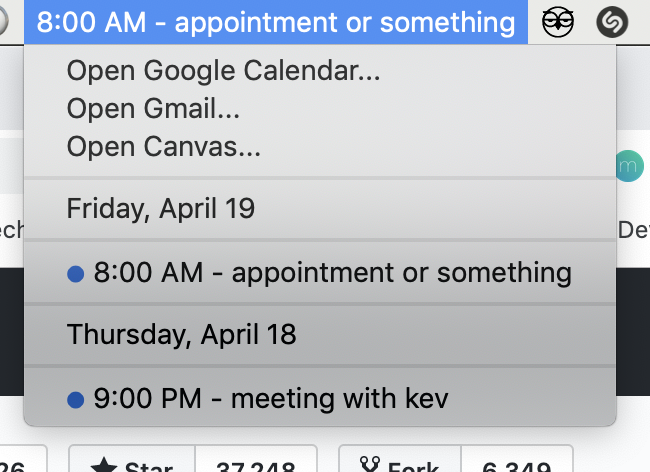

# Hammerspoon

A suite of hammerspoon extensions

# Installation
Install [hammerspoon](https://www.hammerspoon.org/)

Install [Karabiner-Elements](https://pqrs.org/osx/karabiner/)

Clone this repository into ~/.hammerspoon/

Move the karabiner.json file into ~/.config/karabiner/

# Modules

## gcal

menubar extension to interact with __Google Calendar__ events



**Installation**

1. Make sure you have python3 installed
2. Install python packages

```
pip3 install --upgrade google-api-python-client oauth2client python-dateutil
``` 

3. Set PYTHON_BINARY to your python3 binary (run "which python") in init.lua

4. Run gcal/gcal.py -c to set up your active calendars
You'll need to login to google calendar... move the credentials.json file into /gcal

Other goodies...

Bookmarks: Set up your bookmarks in bookmarks/bookmarks.json

# focus

Hyperkey + key to open or focus applications

# monitor

Keybindings used to interact with an external monitor, or between spaces within a monitor. Very useful for moving applications back and forth.

`hyper + shift + right` cycles the current application to monitor on the right

`hyper + shift + keft` cycles the current application to monitor on the left

`hyper + shift + h` moves the current application to a space on the left

`hyper + shift + l` moves the current application to a space on the right

# position

Window positioning module [borrowed](https://gist.github.com/teknofire/a311390d0427c09e7be6044d09c8d372) from Miro Mannino.

`hyper + right` resizes window to right side of screen.

`hyper + left` resizes window to left side of screen.

`hyper + up` resizes window to upper side of screen.

`hyper + down` resizes window to bottom side of screen.

Repeated presses of above keys will cycle window to take up half, quarter, and 2/3 of screen.

`hyper + enter` resizes window to entire screen

Repeated presses of `hyper + enter` will cycle through resizing similarly.

# spaces

`Hyper + shift + h` moves current window left
`Hyper + shift + l` moves current window right

# timer

Pomodoro timer activated through the menubar. Uses a 25-minute work duration.
